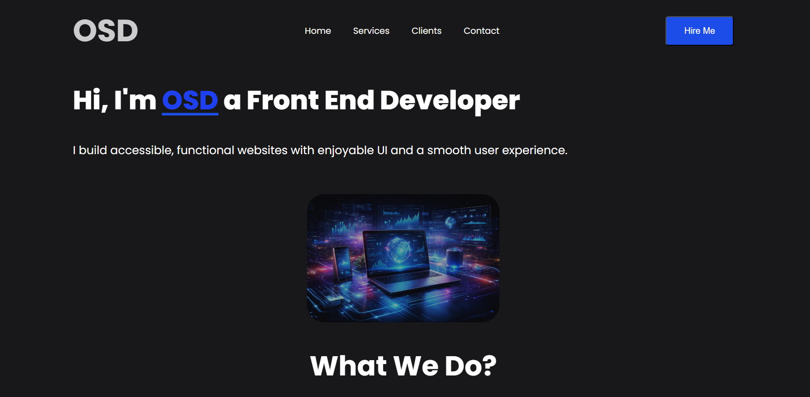
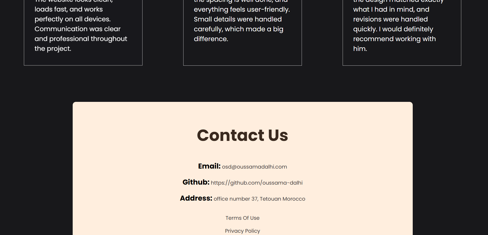

# 🌐 Landing Page

A simple and responsive landing page built with HTML and CSS.
This project focuses on layout structure, styling, and basic web design principles.

---


## ✨ Features

* 📄 Clean and structured layout
* 🎨 Styled using CSS
* 📱 Basic responsive design
* ⚡ Lightweight and fast

---

## 🧠 What This Project Demonstrates

* HTML page structure and semantic elements
* CSS styling and layout techniques
* Organizing assets and stylesheets
* Building a simple UI from scratch

---

## 🛠️ Tech Stack

* HTML5
* CSS3

---

## 📂 Project Structure

```plaintext id="lp12x"
.
├── index.html
├── assets/
│   └── tech.png
└── css/
    └── style.css
```

---

## ⚙️ Getting Started

```bash id="lp98x"
git clone https://github.com/oussama-dalhi/landing-page.git
cd landing-page
```

Open `index.html` in your browser.

---

## 📸 Screenshots


---


---

## 🌟 Future Improvements

* 📱 Improve responsiveness for all screen sizes
* 🎨 Enhance UI design and spacing
* ✨ Add animations or transitions
* 🔗 Add navigation and sections (about, contact, etc.)

---

## ⚠️ Disclaimer

This project was created as part of learning web development fundamentals.

---

## 🙌 Acknowledgements

Built while learning HTML and CSS basics.

---
